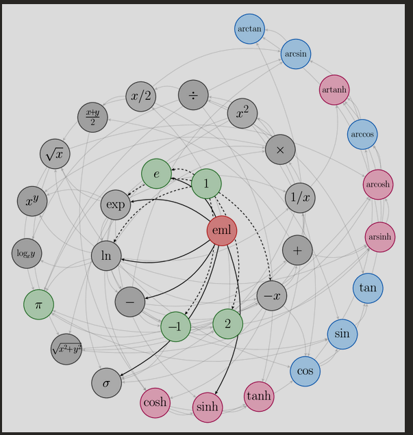

<!---

This file is used to generate your project datasheet. Please fill in the information below and delete any unused
sections.

You can also include images in this folder and reference them in the markdown. Each image must be less than
512 kb in size, and the combined size of all images must be less than 1 MB.
-->

## How it works

### Overview

This design implements a **Sequential EML Engine with Operand Feedback** — a compact hardware accelerator for computing exponential-logarithmic expressions using Mitchell's approximation. Instead of building massive expression trees in silicon, we use a single reusable EML unit and feedback loops to compute nested expressions over multiple cycles.



The results figure explains how a single EML block can be reused across cycles to build nested expressions.

**Core Formula:**
```
out = exp(x) - ln(y)
```

Where `exp()` and `ln()` are computed using Mitchell's fast approximations:
- `exp(x) = 2^(x / ln(2))` = `2^(x * 1.4427)`
- `ln(y) = log2(y) / log2(e)` = `log2(y) * 0.693`

This work is based on the techniques and evaluation presented in the paper at [arXiv:2603.21852](https://arxiv.org/html/2603.21852v2).

### Architecture Components

#### 1. **EML Tile (Combinational)**
The core computation unit ([eml_tile.v](../src/eml_tile.v)):

.svg)

- **No clock** — pure combinational logic
- Computes: `out = exp(x) - ln(y)`
- Uses Mitchell's approximation for fast exp2 and log2
- Fixed-point arithmetic: **Q6.6 format** (12-bit signed)
  - 6 integer bits: range -32 to +31
  - 6 fractional bits: resolution ≈ 0.0156
  - Example: `0.5 → 32` (0.5 × 64), `1.0 → 64`, `2.0 → 128`

**Constants (Q6.6):**
- `INV_LN2 = 92` (≈ 1.4375/1.4427)
- `LN2 = 44` (≈ 0.6875/0.6931)

#### 2. **Feedback Cell (Sequential)**
The stateful wrapper ([eml_feedback_cell.v](../src/eml_feedback_cell.v)):



**Operation Modes (controlled by sel_x, sel_y):**

| sel_x | sel_y | Mode | Computation |
|-------|-------|------|-------------|
| 0 | 0 | Feed-forward | `out = eml(x_ext, y_ext)` — single cycle |
| 1 | 0 | Iterate X | `out_n = eml(out_{n-1}, y_ext)` — reuse X result |
| 0 | 1 | Iterate Y | `out_n = eml(x_ext, out_{n-1})` — reuse Y result |
| 1 | 1 | Cross-feedback | `out_n = eml(out_{n-1}, out_{n-1})` — both operands from prev |

#### 3. **SPI Slave Interface**
The control layer ([eml_spi_wrapper.v](../src/eml_spi_wrapper.v)):



- **Bit-bang SPI protocol** (standard 3-wire: MOSI, SCLK, CS_N → MISO)
- 16-bit frames for command/data exchange
- 3-stage clock synchronizers for cross-domain safety
- Result latching after computation completes

**Register Map:**
- **Addr 0 (RW=0)**: Control register
  ```
  [11:2] = reserved
  [1]    = sel_y  (0=external Y, 1=feedback)
  [0]    = sel_x  (0=external X, 1=feedback)
  [2]    = valid  (write: pulse=1 to trigger; read: n/a)
  ```

- **Addr 1 (RW=0)**: X input register (signed Q6.6)
  ```
  [11:0] = x_ext value
  ```

- **Addr 2 (RW=0)**: Y input register (unsigned Q6.6)
  ```
  [11:0] = y_ext value
  ```

- **Addr 3 (RW=1)**: Result register (read-only)
  ```
  [15:13] = reserved (read as 0)
  [12]    = overflow flag
  [11:0]  = result (signed Q6.6)
  ```

#### 4. **Top Module**
TinyTapeout wrapper ([project.v](../src/project.v)):
- Routes UIO pins to SPI interface:
  - `uio_in[0]` = MOSI
  - `uio_in[1]` = SCLK
  - `uio_in[2]` = CS_N
  - `uio_out[0]` = MISO

### How Sequential Operation Works

**Example: Computing a nested expression**

Goal: Calculate `f(x) = eml(eml(x, 1), 1)` which represents computing:
1. Inner: `temp = exp(x) - ln(1) = exp(x)`
2. Outer: `f = exp(temp) - ln(1) = exp(exp(x))`

**Cycle-by-cycle execution:**

```
Cycle 1 — Load inputs and configure for feed-forward:
  sel_x = 0, sel_y = 0        (use external inputs)
  x_ext = x, y_ext = 1.0
  Result: prev = eml(x, 1.0) = exp(x)

Cycle 2 — Switch to iterate mode (reuse X result):
  sel_x = 1, sel_y = 0        (X from feedback, Y external)
  y_ext = 1.0 (unchanged)
  x_in = prev (from cycle 1)  = exp(x)
  Result: out = eml(exp(x), 1.0) = exp(exp(x)) ✓
```

**Advantage:** Single EML unit does the work of a 2-level tree → **~70% area savings** vs. a pipeline.

### Approximation Accuracy

Mitchell's approximation trades precision for speed:

- **exp(x)**: Error typically < 2% for |x| < 8
- **ln(y)**: Error typically < 2% for y ∈ [0.5, 2.0]
- **Q6.6 quantization**: Additional ±0.78% rounding error

**Typical use cases:**
- Machine learning inference (softmax, sigmoid approximation)
- Signal processing (exponential smoothing)
- Logarithmic compression

For applications requiring higher precision, use external high-precision math libraries.

---

## How to test

### How to run

```bash
pip install -r test/requirements.txt
cd test
make -B
```

---

## External hardware

### Required items

- A host SPI master (capable of 3-wire SPI: MOSI, SCLK, CS_N, and reading MISO)
- A controller/host flow that provides `x`, `y`, and suitable `sel` settings to realize the target expression
- Optional: logic analyzer or oscilloscope for SPI debugging and signal inspection

